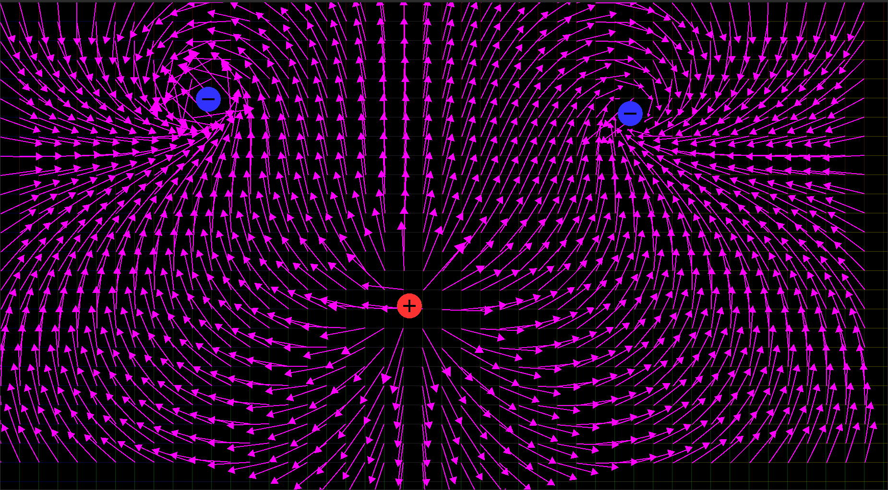

# PlotiPhy2D - Plotter and Intepreter for 2-dimensional Physics

A light and fast 2D plotter to visualise and interpret stationary vector fields with run-time adjustments. Vector fields are _vector-valued_ functions that map any point of a subset of a _d-dimensional_ Euclidean space to a unique _D-dimensional_ vector. In physics, vector fields of interest s.a. the velocity field of a fluid, the electric field of a certain charge distribution or the (classical) gravitational field of a three-body problem, are defined over the _d=D=3_ Euclidean space with dimensions (x,y,z). PlotiPhy2D restricts both the input _d_ and output _D_ space dimensions to _2_ by plotting those physical vector fields defined over a discretised grid of a infinite continuous plane of Cartesian coordinates (x,y). Here's an example produced by the tool library of a 2D electric field E(x,y) generated by a discrete distribution of point-like charges.



The graphics and rendering has been implemented using [SFML](https://github.com/SFML/SFML) while the rest of the code is original.

## Dependencies
Aside from the aforementioned __SFML__, to use this program without any alteration to its source code the user must download and compile the following third-party software:
- [x]  [GCC - GNU Compiler Collection](https://gcc.gnu.org/) (at least version `9.4`);
- [x]  [GNU Make](https://www.gnu.org/software/make/) (at least version `4.2.*`).
To install the above dependencies in a __Debian__-based Linux distro the user can simply run
```
$ sudo apt update
$ sudo apt install build-essential
```
which automatically installs both dependencies.

## Build and execution
The easiest and most straightforward option for building __PlotiPhy2D__ from source is to use __Make__ with __GCC__. Invoking `make` from the top-level directory of this repository will compile __PlotiPhy2D__ source files and link with __SFML__'s necessary modules. In such rule it is included the automatic execution of the resulting executable file `PlotiPhy` however the user can easily disable that by commenting out line 3 of the `makefile`. Also the rule `make clean` will remove all the `.o` object files generated by the compiler alongside the executable file itself.

## Usage
At the current state, __PlotiPhy2D__ only impelements 2D static electric field with an arbitrary large amount of point-like charges distributed on the screen with no GUI. Users can interact with the window by either pressing the right or left button to create on the window cursors' spot a positive or negative charge respectively.